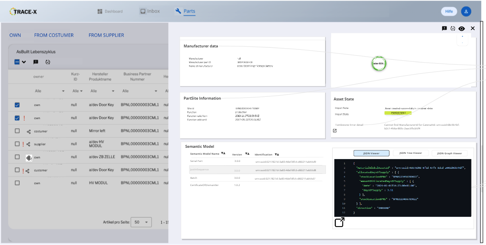
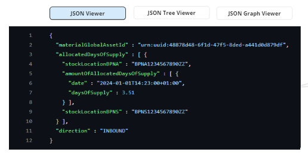
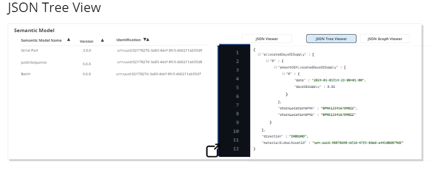
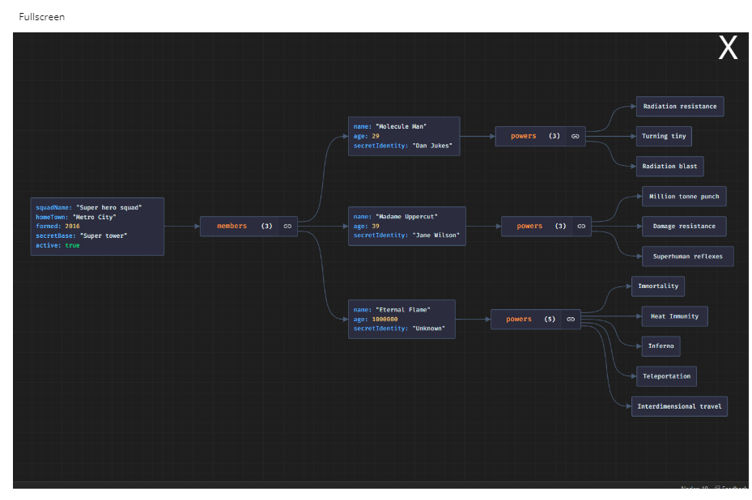

# #435 Display-Aspect-Models-connected-to-twin-generic

| Key           | Value                                                                                                                                                                                                                      |
|---------------|----------------------------------------------------------------------------------------------------------------------------------------------------------------------------------------------------------------------------|
| Author         | @ds-mkanal                                                                                                                                                                                                                 |
| Creation date | 28.02.2024                                                                                                                                                                                                                 |
| Ticket Id     | [#435](https://github.com/eclipse-tractusx/traceability-foss/issues/435) [#710](https://github.com/eclipse-tractusx/traceability-foss/issues/710) [#711](https://github.com/eclipse-tractusx/traceability-foss/issues/711) |
| State         | DRAFT                                                                                                                                                                                                                      |

# Table of Contents
1. [Overview](#overview)
2. [Summary](#summary)
3. [Problem Statement](#problem-statement)
4. [Requirements](#requirements)
5. [NFR](#nfr)
6. [Out of scope](#out-of-scope)
7. [Assumptions](#assumptions)
8. [Concept](#concept)
9. [Glossary](#glossary)
10. [References](#references)
11. [Additional Details](#additional-details)

# Overview
Trace-X is an application in which quality issues can be processed. For the processing of these quality issues, both for the correct addressing of the quality incident and for a more in-depth search, a large number of semantic models must be accessed depending on the application. The information gained should not be regulated for Quality Expert working with Trace-X Busines App. All semantic models linked to a digital twin should be available for processing.

# Summary
Trace-X can currently display a defined number of semantic models of the BOMLifecyles asPlanned and asBuilt.
In the future, it can be assumed that further as yet unspecified semantic models will be developed which will also be represented in Trace-X.
Trace-X will be developed to generically handle different existing and planned semantic models.

# Problem Statement
- Trace-X can currently display a fixed number of semantic models.
- This involves the well-known semantic models of BOMLifecyle asPlanned and asBuilt (SerialPart, SingleLevelUsage*, SingleLevelBOM, PartAsPlanned, PartSiteInformationAsPlanned, JustInSequence)
- In addition, there is a further set of semantic models which are not currently part of the Trace-X domain model and therefore cannot be displayed at present.
- To avoid having to map every available semantic model in the domain model, there is a requirement to display other semantic models in a more generic form.

# Requirements
- [ ] All semantic models connected to a digital twin can be viewed by a Trace-X user
- [ ] Display of digital twin connected semantic models raw payload in Trace-X FE
- [ ] Display of digital twin connected semantic models payload as graph view in Trace-X FE
- [ ] Display of digital twin connected semantic models payload as tree view in Trace-X FE
- [ ] Semantic Model is displayed with version of semantic model
- [ ] Line numbering for raw and tree viewer

# NFR
- [ ] Panel with consistent UUX according to C-X Style Guide
- [ ] Panel with consistent UUX

# Out of scope
- Switching between viewer instances in full-screen-mode
- Enabling and disabling of code highlighting (code highlighting is the default)

# Assumptions
There are further aspect models as the ones currently known (SerialPart, Batch, JiS, PartAsPlanned, PartSiteInformation) in the two BomLifecycle asPlanned and asBuilt which are currently implemented and will be relevant in the future.

# Concept

## BE API Extensions
- API GET /assets/as-planned/{assetId}
    - add version attribute to detailAspectModels
    - add payload (link) of semantic models to detailAspectModels
    - add identification attribute to detailAspectModels
- API GET /assets/as-planned/*/children/{childId}
    - add version attribute to detailAspectModels
    - add payload (link) of semantic models to detailAspectModels
    - add identification attribute to detailAspectModels
- API GET /assets/as-built/{assetId}
    - add version attribute to detailAspectModels
    - add identification attribute to detailAspectModels
    - add payload (link) of semantic models to detailAspectModels
- API GET /assets/as-built/*/children/{childId}
    - add version attribute to detailAspectModels
    - add identification attribute to detailAspectModels
    - add payload (link) of semantic models to detailAspectModels

## UI Mocks
Source: https://miro.com/app/board/uXjVO5JVoho=/?moveToWidget=3458764572353049533&cot=14

### Changes in DetailView Overlay

- [ ] Detail View must  be scrollable with vertical scrollbar
- [ ] New Panel "Semantic Models" is added to Detail View (de: Semantische Modelle)
- [ ] Panel "Semantic Models" contains table
- [ ] Table contains all "Semantic Models" for selected asset
- [ ] Table contains columns "Semantic Model Name" (de: refer to current translation
- [ ] Table contains columns "Version" of semantic model (de:Version)
- [ ] Table contains columns "Semantic Model Id" of semantic model (de:ID Semantisches Modell) /== "Identification" of submodel in IRS response /
- [ ] Table columns are sortable (Name alphanumeric, Version uses numeric, natural sorting!)
- [ ] Table columns are NOT filterable
- [ ] Table with vertical and horizontal scrollbar (No pagination)
- [ ] Viewer Panel has fixed size.
- [ ] User selected of Viewer Instance is stored in User Settings. Last selected Viewer Instance will be used for next semantic model selection.
- [ ] User selected semantic model in table is highlighted in dark grey color

### Json Code Raw Viewer
- Json Raw Viewer
- Code Highlighting
- Line Numbering
- Vertical scrollbar
- Extend Viewer Panel is extendable to full-screen

### Json Tree  Viewer

Json Tree Viewer is the visualization of a JSON structure in a hierarchical tree format.

- Json Tree Viewer
- Json is visualized in tree view
- Code Highlighting
- Line Numbering
- Extend Viewer Panel is extendable to full-screen
 

### Json Graph Viewer
- Json Tree Viewer
- Json is visualized in graph view
- Code Highlighting
- Extend Viewer Panel is extendable to full-screen

## Viewer in full-screen mode

- Any viewer instance could be extended to full-screen mode
- Full-screen mode is disabled via X button on the right upper side.
- After closing, full-screen former detail view is shown

## Error View
- Viewer shows error icon
- Viewer show initial message Semantic model cannot be displayed.
- Standard error message: Semantic model cannot be displayed. With detailed user readable message

# Glossary

| Abbreviation | Name | Description   |
|--------------|------|---------------|
|              |      |               |
|              |      |               |

# References
- https://miro.com/app/board/uXjVO5JVoho=/?moveToWidget=3458764572353049533&cot=14

# Additional Details
Given the dynamic nature of ongoing development, there might be variations between the conceptualization and the current implementation. For the latest status, refer to the documentation.
