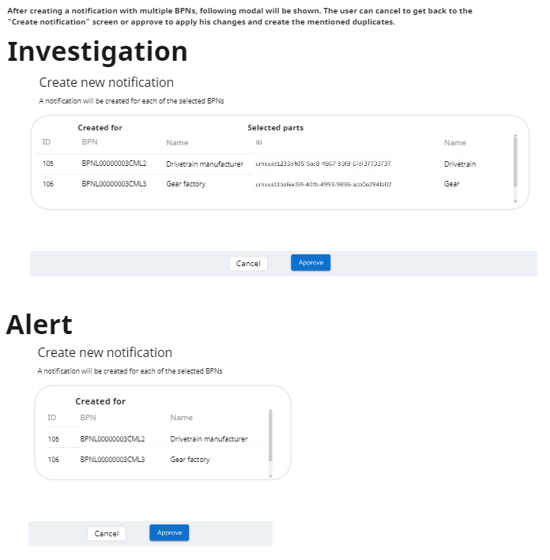
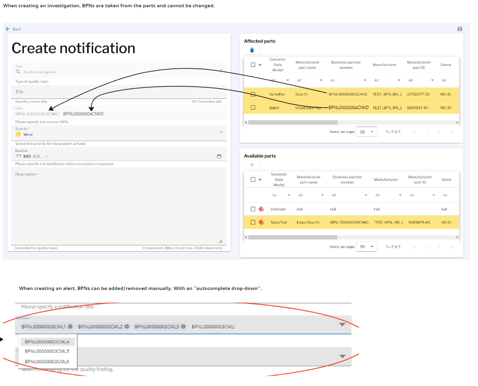

# \[Concept\] \[#849\] Quality notifications to multiple BPNs

| Key           | Value                                                                    |
|---------------|--------------------------------------------------------------------------|
| Author        | @ds-crehm                                                                |
| Creation date | 22.04.2024                                                               |
| Ticket Id     | [#849](https://github.com/eclipse-tractusx/traceability-foss/issues/849) |
| State         | DRAFT                                                                    |

# Table of Contents
1. [Overview](#overview)
2. [Requirements](#requirements)
3. [Out of scope](#out-of-scope)
4. [Concept](#concept)
5. [Additional Details](#additional-details)

# Overview
Instead of having "messages" that can be sent to multiple BPNs within one notification, multiple notifications must be created.
Those can be individually edited and sent to the specific BPN.

# Requirements
- For alerts, when selecting multiple BPNs, a duplicated alert for each of the selected BPNs is created.
- For investigations, when selecting parts from different BPNs, a duplicated investigation for each of the BPNs is created.
- The data model is changed to make this process possible.
- Notifications are tied to single BPNs and cannot be sent to multiple BPNs anymore.
- BPN selection is possibly for alerts.
  - Autocomplete filter -> Selection shows all matching BPNs (if there are more than 10, this selection is scrollable).
  - Selected BPNs are shown as chips that can be removed.
- BPN selection is disabled for investigations, instead the BPNs are "pulled" from the selected parts.
- The frontend modals appear when a user is creating notifications and triggers a notification duplication.
- In the modal the user has the chance to cancel or approve the process.

# Out of scope
- A duplication process for the user. In case the user wants to retroactively add BPNs to an existing notification or send a notification to a BPN that was not selected during the creation of this notification,
he must create a new notification and copy the data. In the future, there might be the possibility to add a "Duplicate notification" or "Copy notification" process to Trace-X, but that is out of scope for this concept.

# Concept
## Backend
Messages within one notification can only be sent between **two** BPNs. To make it possible to send notifications to multiple BPNs, notifications are duplicated during the creation process.
A unique grouping label will be set for each notification created during the same process to identify notifications belonging to the same 'topic'. This label can be added/removed afterwards.
It is an optional field and during the creation process, it will be checked if the case is already in use. If it is, the user will be notified to change the case.

```diff
{
    "id": 423,
    "title": null,
    "status": "CREATED",
    "description": "2024-04-25T07:46:29.523Z-requested-by-chris",
+   "case": "CASE-ID123",
    "createdBy": null,
    "createdByName": null,
    "createdDate": "2024-04-25T07:28:42.538791Z",
    "assetIds": [
        "urn:uuid:5205f736-8fc2-4585-b869-6bf36842369a"
    ],
    "channel": "SENDER",
    "reason": {
        "close": null,
        "accept": null,
        "decline": null
    },
    "sendTo": null,
    "sendToName": null,
    "severity": "MINOR",
    "type": "ALERT",
    "targetDate": null,
    "messages": []
}
```

#### Alert creation
When an alert is created, multiple BPNs can be selected. For each of the recipients the notification will be duplicated.
The data will be identical except for the "createdFor" and "createdForName" fields.
If the data must be changed, the user can do it afterward in the "edit notification" view.

#### Investigation creation
When an investigation is created, multiple parts can be selected. Whenever a part from a different BPN is selected, the notification will be duplicated.
The data will be identical except for the "createdFor", "createdForName" and "assetIds" fields. Each notification will only contain parts from the same BPN.
If the data must be changed, the user can do it afterward in the "edit notification" view.

#### Edit notifications
When editing notifications, only parts with the identical BPN as the "createdFor" BPN will be shown and the user may not add BPNs manually.
There is no possibility to create a new notification from the "Edit notifications" process.
If the user wants to send an existing notification to a different BPN, he must copy the data and use the "Create notification" process.

## Frontend



New case label:


See https://miro.com/app/board/uXjVO5JVoho=/?moveToWidget=3458764586657591852&cot=10

# Additional Details
Given the dynamic nature of ongoing development, there might be variations between the conceptualization and the current implementation. For the latest status, refer to the documentation.
